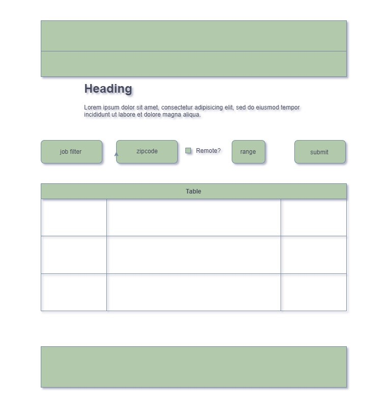

# VWC Job Finder

## Project Planning Meeting for "VWC Job Finder" a.k.a. "Javascript Job Search"

### User Story

- User's name is Jodi
- Former Army enlisted
- Married, has children, or both.
- Has served out one enlistment in the military and is 2-5 years after their ETS Date
- Lives in a city that is on the third wave of tech (not the big cities)
- What is driving their tech industry is colleges and healthcare
- The job market for the user's city consists of jobs where the backend is .NET and the front end is React
- The developer needs to learn how to work with APIs coming over the fence from .NET
- The user is lazy
- They should be able to come and type in their zip code or city, state, and radius and see all matching jobs (infinite scroll)
- They should be able to get remote options
- The user wants to get jobs that match his skill set
- The user wants to get the link to apply and be able to upload their resume without much trouble
- They want to login easily after searching for jobs and then send resume
- The user is tech adjacent looking to get into tech with minimal experience (one to two years)
- The average age for this user is 28-37 and they are male

### Requirements

- The app will pass parameters in real time
- We will set things that we need to feed in the jobs
- Header, footer, body
- Use draw.io for the mockup
- Jobs need to be relevant to the skills #VetsWhoCode teaches
- Infinite scroll
- Indeed API
- Version 2 can include custom VetsWhoCode API where we can add custom job results based on opportunities we know about
- We will use SMACSS to create a design system similar to Designsystem.digital.gov (US Web Design System USWDS)
- We can use the VWC design system we can start the migration from bootstrap with our own design system
- The table for the site will be done is css grid
- Bootstrap 3.3.6 for the layout
- brand text needs to be closer to the VHC icon in the navbar
- links should be closer to the left on navbar to make room for more links
- the dark mode moon icon in the navbar should be pulled to the right with the donate button
- no login requirement for mvp
- no twitter links in the grid
- no bookmarking jobs
- every job returned should have 2 or 3 explicit skills taught by VHC

### Mockup

